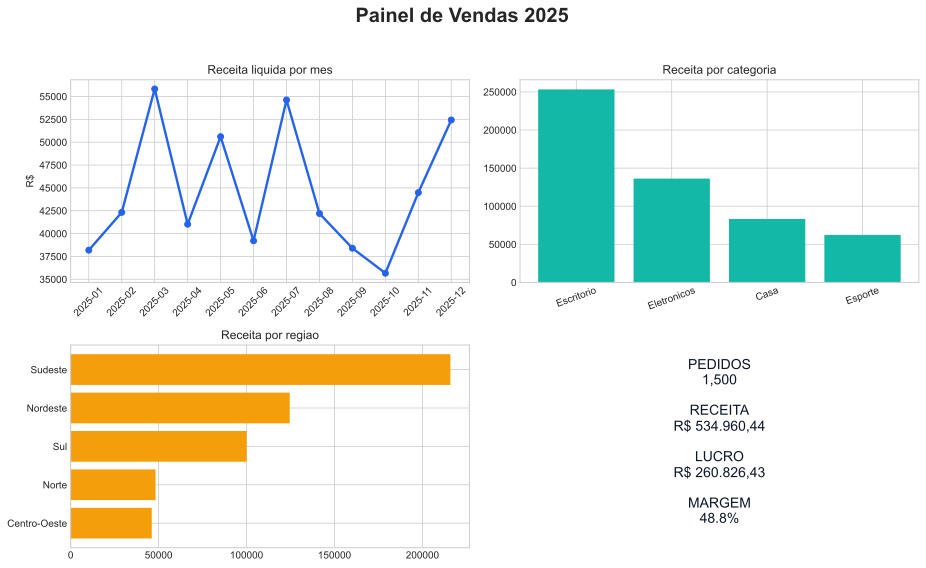

# Analise de Vendas com Python, SQL e Power BI

Projeto de portfolio que transforma uma base de vendas em indicadores para apoiar decisoes comerciais. A solucao cobre geracao de dados ficticios, validacao, ETL com Pandas, consultas SQL e uma tabela pronta para Power BI.



## Perguntas respondidas

- Qual foi a receita, o lucro, a margem e o ticket medio?
- Como as vendas evoluiram ao longo de 2025?
- Quais categorias e regioes geraram mais resultado?
- Quais clientes concentraram maior valor de compra?

## Tecnologias

`Python` · `Pandas` · `Matplotlib` · `MySQL` · `SQLite` · `Power BI` · `Pytest`

## Resultados da base simulada

- 1.500 pedidos e 458 clientes analisados;
- R$ 534.960,44 de receita liquida;
- R$ 260.826,43 de lucro e margem de 48,76%;
- ticket medio de R$ 356,64;
- Escritorio foi a categoria com maior receita.

## Estrutura

```text
data/raw/                 base ficticia original
data/processed/           tabela tratada para Power BI
src/etl.py                 validacao e transformacoes
src/analysis.py            KPIs, tabelas, banco SQLite e dashboard
sql/                       schema MySQL e consultas de negocio
tests/                     testes automatizados do ETL
outputs/                   resultados gerados
```

## Como executar

```bash
python -m venv .venv
# Windows: .venv\Scripts\activate
pip install -r requirements.txt
python generate_data.py
python src/analysis.py
pytest -q
```

## Principais cuidados de dados

- validacao de colunas obrigatorias;
- bloqueio de pedidos duplicados;
- validacao de quantidade, preco e desconto;
- calculo reproduzivel de receita, custo, lucro e margem;
- separacao entre dado bruto e dado processado.

> Todos os dados deste projeto sao ficticios e foram gerados por codigo. O objetivo e demonstrar raciocinio analitico e organizacao de um projeto de dados.
